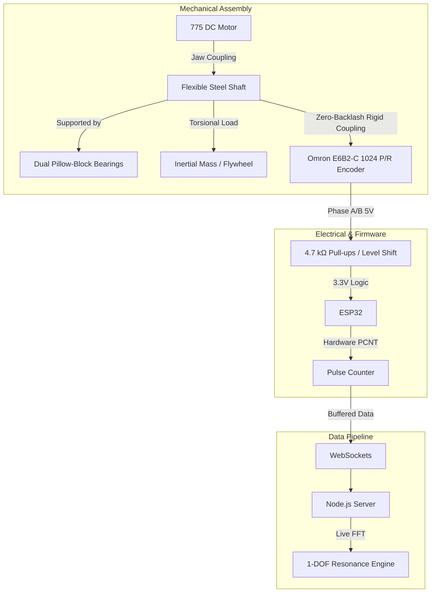
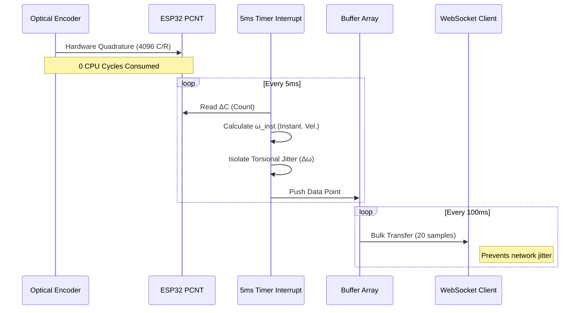

# Digital Torsional Rig: High-Frequency Jitter Analysis & Resonance Telemetry

> **Date:** June 2026
> **Department:** Solid Mechanics Laboratory
> **Project Level:** Prototype & Educational Apparatus Design

## 1. Executive Summary & Project Objectives

**Objective:** Modernize the solid mechanics lab by capturing continuous, high-frequency torsional vibration ($\Delta\omega$) digitally—replacing outdated manual stroboscopic readings with real-time, precision telemetry.

**Key Engineering Goals:**
- **Precision Telemetry:** Capture microscopic angular velocity fluctuations using a 1024 P/R optical encoder operating at up to 4,096 counts per revolution.
- **Overcome Hardware Bottlenecks:** Offload high-frequency pulse counting from the main CPU to dedicated hardware peripherals (ESP32 PCNT) to ensure signal integrity.
- **Seamless Integration:** Stream pre-processed datasets directly into the existing 1-DOF Resonance Analysis Engine for live Fast Fourier Transform (FFT) processing.

## 2. System Architecture

## 3. Step-by-Step Build Process

### Step 1: Mechanical Construction
1. **Chassis Assembly:** Construct the base frame using T-slot 2020 aluminum extrusions. This provides a rigid, zero-flex baseline to isolate external vibrations.
2. **Drive System Installation:** Mount the 775 DC Motor to the chassis. Connect it to the flexible steel shaft using a flexible jaw (spider) coupling to strictly isolate drive-motor vibrations from the test apparatus.
3. **Shaft & Bearings:** Support the flexible steel shaft (hexagonal or round, approx. 400–500 mm) using dual pillow-block bearings. This constrains lateral whirling while permitting torsional twist.
4. **Inertial Mass:** Mount the custom-machined brass flywheel (Ø 100 mm) onto the shaft to induce measurable torsional shear lag and dynamic resonance.
5. **Measurement Node:** Rigidly mount the Omron E6B2-C optical encoder to the frame. Interface it to the rotating shaft via a zero-backlash rigid coupling.

### Step 2: Electrical Integration
* **The "Interrupt Trap" Problem:** Standard GPIO interrupts at shaft speeds > 1,200 RPM generate over 40,000 pulses/sec, which would monopolize the CPU and cause WebSocket connection drops.
* **Solution:** Route Encoder Phase A and B directly to the ESP32’s native Pulse Counter (PCNT) peripheral.
* **Wiring & Protection:** Use 4.7 kΩ pull-up resistors to safely condition the 5V NPN open-collector encoder lines to the 3.3V ESP32 logic levels, preventing pin damage.

### Step 3: Firmware & Data Pipeline

**Data Mathematics:**
1. **Instantaneous Angular Velocity:** $\omega_{inst} = \frac{\Delta C}{4096 \times (\Delta t \times 10^{-6})}$ [rev/s]
2. **Torsional Jitter Isolation:** Subtract rolling mean speed to remove DC motor component: $\Delta\omega = \omega_{inst} - \omega_{mean}$

## 4. Interactive 3D Visualization

The project includes an `index.html` digital twin developed using WebGL to simulate the kinematics of torsional resonance.
- **Live Torsional Twist:** Real-time $\Delta\omega$ visualization as the shaft mathematically deforms under load.
- **10x High-Speed Camera Mode:** Time-scaling bypasses monitor Nyquist refresh-rate limits, clearly showing high-RPM phase lag and shear waves.
- **Accurate Clearances:** Demonstrates physical isolation between the spinning test shaft and the stationary encoder housing.

## 5. Software Integration & Lab Applications

Streaming clean $\Delta\omega$ arrays directly to the 1-DOF Resonance Engine unlocks:
- **Live FFT Analysis:** Real-time Fast Fourier Transforms to identify dominant torsional vibration frequencies.
- **Damping Coefficient Calculation:** Calculate structural damping ratios via logarithmic decrement formulas using the perfectly resolved time-domain decay waveform.
- **Automated Reporting:** Generate AI-assisted lab reports directly from live hardware data arrays, eliminating manual transcription.

## 6. Bill of Materials & Budgeting (Locally Sourced - Kenya)

Designed for lean, local sourcing to undercut commercial rigs (KES 200,000+).

| Component | Description | Est. Cost (KES) |
| :--- | :--- | :--- |
| **Microcontroller** | ESP32 Development Board | 1,200 |
| **Optical Encoder** | Omron E6B2-CWB6C 1024 P/R | 5,500 |
| **Mechanics** | Flexible shaft & pillow-block bearings | 1,800 |
| **Inertial Mass** | Custom-machined brass/steel flywheel | 1,800 |
| **Drive System** | 775 DC motor + jaw coupling | 1,800 |
| **Frame** | 2020 Aluminum extrusions | 2,000 |
| **Electronics** | Resistors, shielded cables, proto-board | 300 |
| **TOTAL** | **Estimated Prototype Cost** | **≈ KES 14,400** |
